<h1>Memoria del proyecto fin de evaluación de Lenguajes de Marcas - 1º DAM/DAW</h1>
<h2>Persona-5-Royal</h2>
<h2>Indice</h2>
<ul>
  <li><a href="#introduccion">Introducción</a></li>
  <li><a href="#motivacion">Motivación</a></li>
  <li><a href="#estructura">Estructura</a></li>
  <li><a href="#estilo">Estilo</a></li>
</ul>

<h2 id="introduccion">Introducción</h2>

Trabajo realizado en clase por: Francisco Jimenez Lopez

Proyecto de web "from scratch" de 1ª evaluación de Lenguajes de Marcas

Diciembre de 2023 

Licencia CC-BY

<h2 id="motivacion">Motivación</h2>

El tema lo he elegido porque es un juego que me acompaño durante la cuarentena y me gusto como criticaba ciertos aspectos de la sociedad 
  mientras trataban de buscarle una solucion dentro de sus limites

<h2 id="estructura">Estructura</h2>

La web está dividida en  5 secciones:

<ul>
  <li>Hero Section</li>  
  <li>personaje</li>
  <li>palacios</li>
  <li>trailers</li>
  <li>Formulario</li>
  <li>footer</li>
</ul>

<h3>Hero Section</h3>
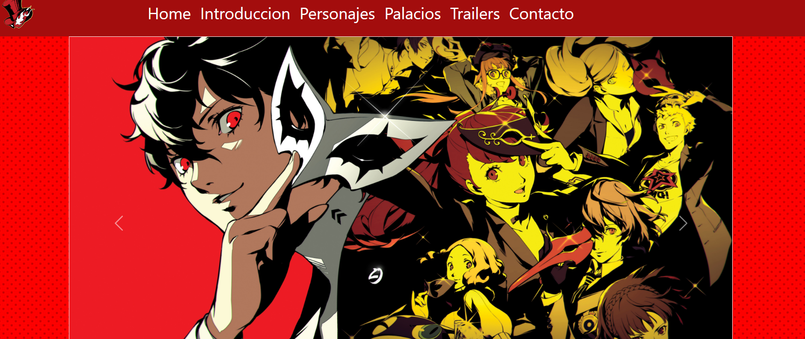

He utilizado varias imagenes de fondo unidas con un slider que se adapta fácilmente a diferentes dispositivos 
Un par de botones una a cada lado para poder recorrer el slider 

Este slider fue tomado de la pagina oficial de bootstrat

<h3>Transiciones</h3>

Imagenes usadas para las transiciones entre las section de la pagina para darle un toque distinto a la pagina  

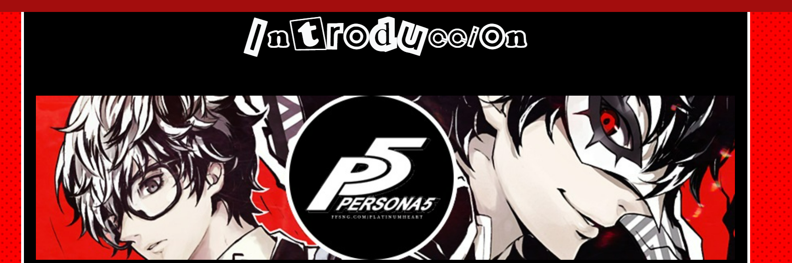
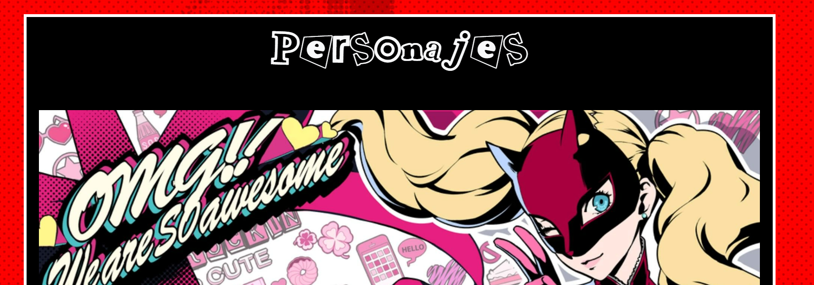
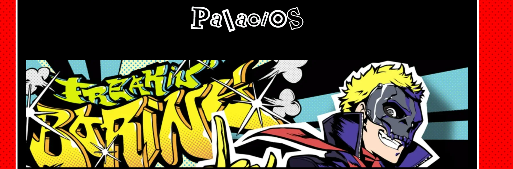
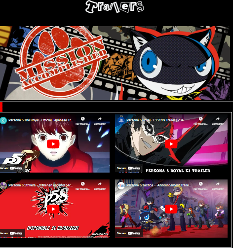
<h3>personajes</h3>

He dispuesto varias imagenes colocadas consecutivamente y que muestran informacion de los personajes mediante cuadros de texto, adornados mediante bordes y sombras para parecerse a el estilo de las ventanas del propio juego,ademas deun efecto parallax de fondo, estos estan colocados a la derecha de la pantalla para que no se vea el corte de las imagenes y asemeje a los dialogos del propio juego

<h3>trailer</h3>

He ordenado los trailers en un contenedor que se va adaptando segun el tamaño de la pantalla pasando de dos columnas a una segun el tamaño de la pantalla

<h3>palacios</h3>
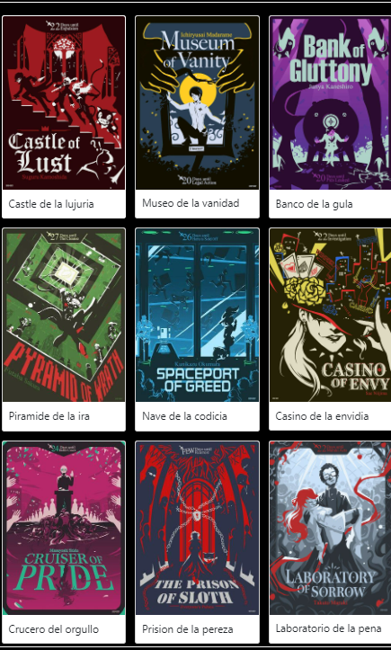

He cambiado las imagenes en abanico por un grid de 3 columnas que se van autodimensionando buscando la responsividad

<h3>footer</h3>
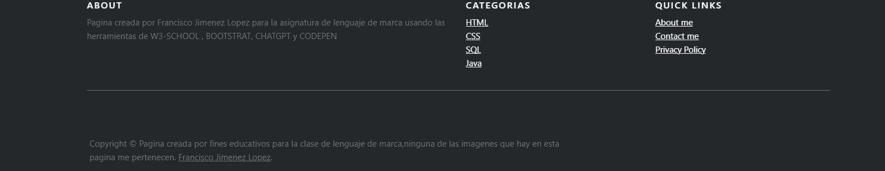

He dispuesto en un grid de 3 columnas con lo que ha futuro llevara un repositorio con informacion laboral mia, pero aun son "enlaces" de muestra ya que no llevan a ningun lado</b>

<h2 id="estilo">Estilo de la página</h2>
<h3>Paleta de colores</h3>

<h3>Imágenes</h3>

Creditos a cada creador de cada imagen por separado, hace tiempo que busque estas imagenes y ya no se de donde vienen 
la mayoria, algunos de google(a saber que pagina)y otras de pinterest

    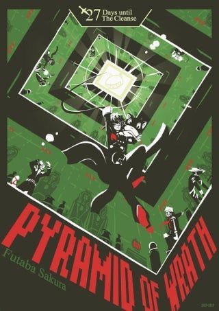
    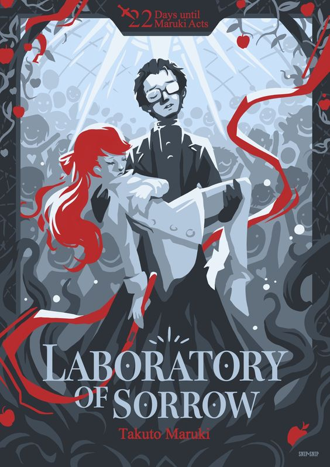
    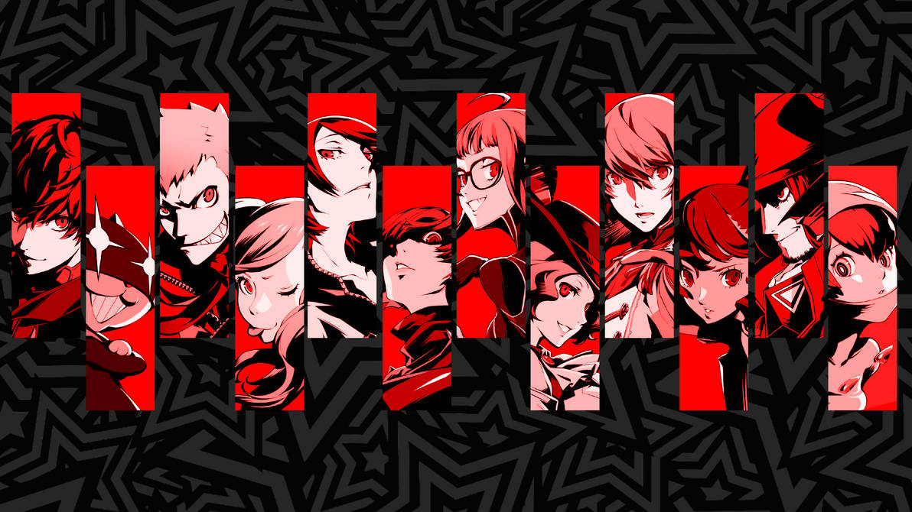
    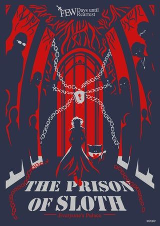
    
    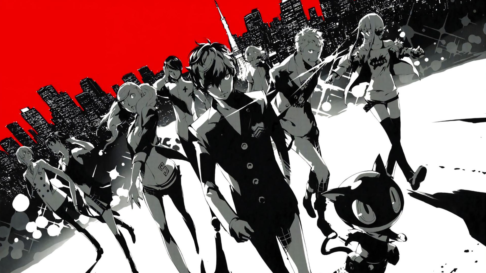
    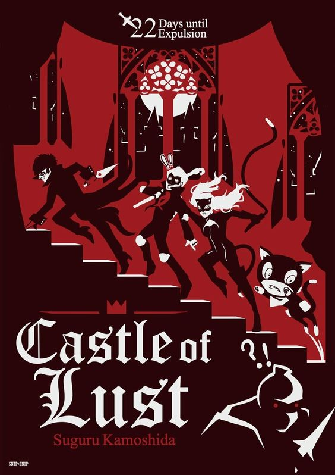
    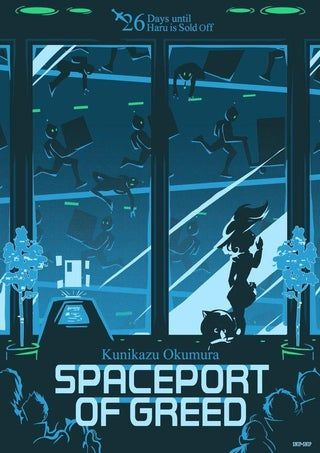
    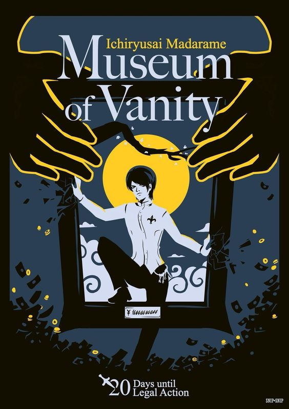
    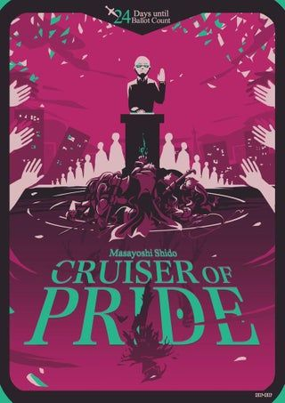
    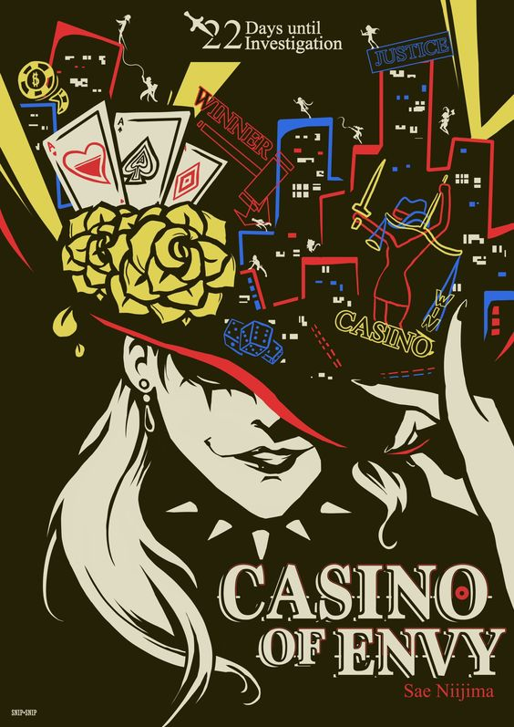
    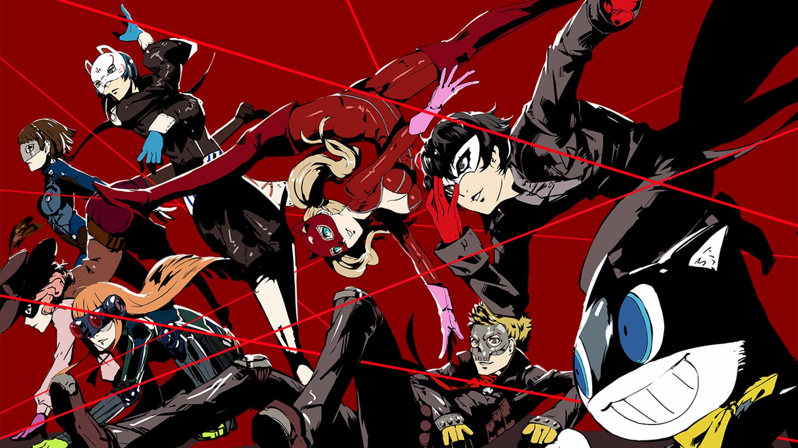
    

<h3>Videos</h3>

Los unicos videos son los trailers de youtube

...................
<h2 id="snippets">Code snippets</h2>

He utilizado los siguientes:

<ul>
  <h2> Font </h2>
  enlace:https://www.actionfonts.com/persona-5-font/
  en mi opinion no me agrada demasiado , la coloco unicamente por el criterio de correccion
  <li>Barra de navegación: tomada de Get Started bootstrat https://getbootstrap.com/docs/5.3/getting-started/introduction/</li>

</ul>
